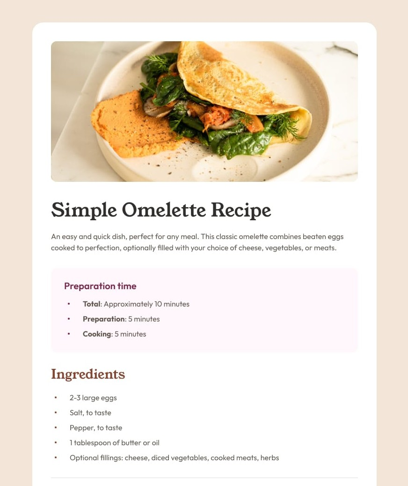
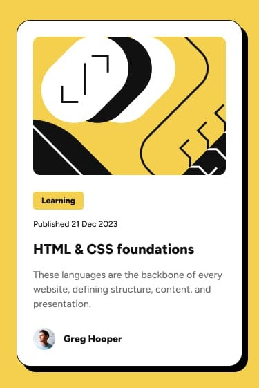

# React Learning Journey

Welcome to my portfolio of React challenges. This repository documents my progression in building modular, component-based user interfaces.

## Projects

### 1. Simple Omelette Recipe
A responsive recipe page showcasing component structure and data rendering.

 

### 2. Blog Preview Card
A card component focused on layout, hover states, and semantic HTML structure.

---

## Technical Skills
* **Frameworks:** React
* **Styling:** CSS3, Modular Styles
* **Structure:** Semantic HTML5, Component Composition
* **Version Control:** Git & GitHub

## Goal
These challenges helped me solidify my understanding of the React ecosystem, specifically focusing on building clean, reusable components and translating visual designs into functional code.

---
*Created by Aocheng Ye*
